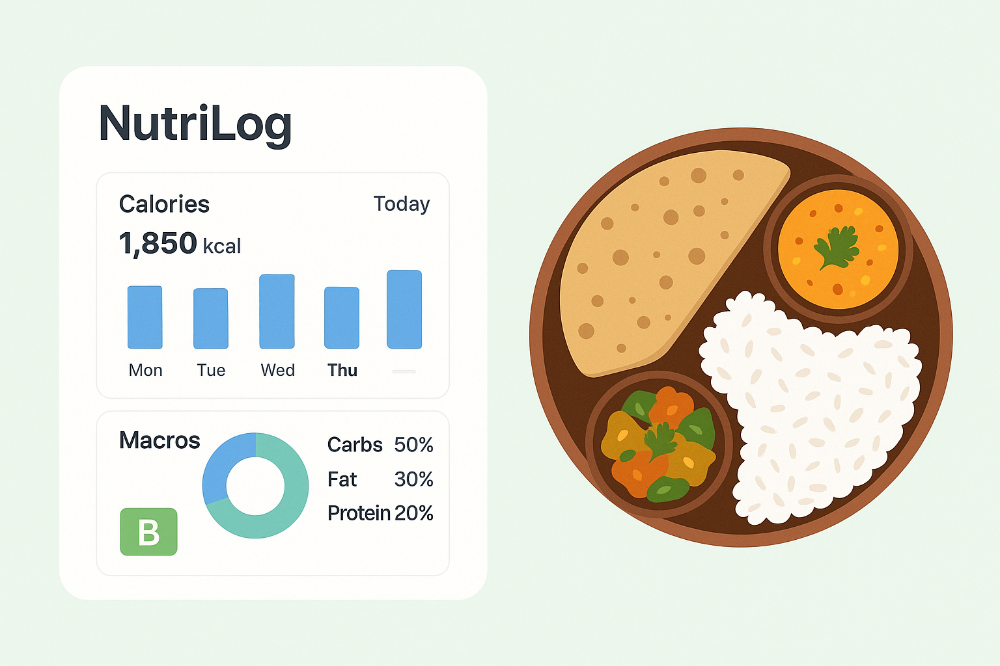

<div align="center">
  <br />
      
    </a>
  <br />

  <div>
    
    
    <br/>
    
    
    

  </div>

   <div align="center">
        <h2 align="center"><b>NutriLog</b> <br/>
        Smart Nutrition Tracking for Indian Cuisine - Track your meals, macros, and achieve your fitness goals with Unique Meal Grading and a comprehensive Indian food database.</h2>
   </div>
</div>

## 📋 <a name="table">Table of Contents</a>

1. ✨ [Introduction](#introduction)
2. 🔋 [Features](#features)
3. 🎯 [Demo](#demo)
4. ⚙️ [Tech Stack](#tech-stack)
5. 🚀 [Getting Started](#quick-start)
6. 🤝 [Contributing](#contribution)


## <a name="introduction">🌟 What Makes NutriLog Special?</a>

**NutriLog** is not just another calorie tracker. It's specifically designed for Indian users with:

- 🇮🇳 **1000+ Indian Foods Database** - Pre-loaded with accurate macros for Aloo Paratha, Dosa, Biryani, and more
- 🎯 **Unique Meal Grading** - Get instant A-F grades on meal balance
- ⚡ **Lightning Fast Logging** - Log meals in under 30 seconds
- 📊 **Smart Analytics** - Visual insights into your nutrition patterns
- 🎨 **Beautiful UI** - Modern, responsive design with Tailwind CSS

Unlike other Fitness apps and Nutrition trackers, **NutriLog understands Indian food** with different variations (Home Style, Restaurant Style, Low Oil, etc.) for authentic tracking.

---

## <a name="features">✨ Features</a>

### 🍴 Food & Meal Management
- **Custom Food Database** - Add your own foods with detailed macros
- **1000+ Pre-loaded Indian Foods** - Breads, curries, rice, snacks, desserts, and more
- **Smart Food Search** - Find foods instantly with category filters
- **Meal Composition** - Build meals from multiple foods
- **Quantity Calculator** - Automatic macro scaling based on portion size
- **Meal Variations** - Classic, Home Style, Restaurant Style, Low Oil, High Protein

### 📈 Tracking & Analytics
- **Daily Calorie Tracking** - Monitor your intake vs. targets
- **Macro Distribution** - Track carbs, protein, and fats
- **Meal Grading System** - A-D grades based on nutritional balance
- **Weekly Summaries** - Visual charts and trends
- **Goal Progress** - Track weight loss, maintenance, or muscle gain goals
- **Historical Data** - View past meals and trends

### 👤 Profile & Personalization
- **Custom Macro Targets** - Set your own carbs/protein/fats ratios
- **Activity Level Adjustment** - Sedentary to very active
- **Goal-Based Recommendations** - Calorie targets based on your goals
- **BMI Tracking** - Monitor your body metrics
- **Member Since** - Track your journey from day one

### 🎨 User Experience
- **Beautiful Dashboard** - Clean, modern interface
- **Responsive Design** - Works on desktop, tablet, and mobile
- **Toast Notifications** - Real-time feedback for all actions
- **Loading Skeletons** - Smooth loading states
- **Dark Mode Ready** - Easy on the eyes (future feature)
- **Keyboard Shortcuts** - Navigate faster (future feature)

### 🔒 Security & Authentication
- **Secure Authentication** - Powered by Better-Auth
- **Session Management** - Secure cookie-based sessions
- **Protected Routes** - API-level security
- **Data Privacy** - Your data is yours alone
- **Password Security** - Hashed and salted passwords

---


## <a name="demo">🎯 Demo</a>

### Live Demo
🚀 **[Try NutriLog Live](https://nutri-log-gold.vercel.app)**


### Quick Tour
1. **Sign up** - Create your account in seconds
2. **Set Profile** - Enter your age, weight, goals
3. **Search Foods** - Find "Aloo Paratha" - see all variations!
4. **Log a Meal** - Build your breakfast, get graded instantly
5. **View Analytics** - See your weekly nutrition trends

---

## <a name="tech-stack">🛠️ Tech Stack</a>

### Frontend
- **[Next.js 15](https://nextjs.org/)** - React framework with App Router
- **[TypeScript](https://www.typescriptlang.org/)** - Type-safe development
- **[Tailwind CSS](https://tailwindcss.com/)** - Utility-first styling
- **[shadcn/ui](https://ui.shadcn.com/)** - Beautiful React components
- **[Lucide Icons](https://lucide.dev/)** - Modern icon library
- **[React Hook Form](https://react-hook-form.com/)** - Form management
- **[Zod](https://zod.dev/)** - Schema validation
- **[Recharts](https://recharts.org/)** - Data visualization
- **[Sonner](https://ui.shadcn.com/docs/components/sonner)** - Toast notifications

### Backend
- **[Next.js API Routes](https://nextjs.org/docs/api-routes/introduction)** - Serverless API
- **[MongoDB Atlas](https://www.mongodb.com/atlas)** - Cloud database
- **[Mongoose](https://mongoosejs.com/)** - MongoDB object modeling
- **[Better-Auth](https://better-auth.com/)** - Authentication library

### Development Tools
- **[ESLint](https://eslint.org/)** - Code linting
- **[Git](https://git-scm.com/)** - Version control
- **[Vercel](https://vercel.com/)** - Deployment platform

---

## <a name="quick-start">🚀 Getting Started</a>

### Prerequisites
- **Node.js** 18.x or higher
- **npm** or **yarn**
- **MongoDB** account (free tier works!)
- **Git**

### Installation

1. **Clone the repository**
```bash
git clone https://github.com/yourusername/nutrilog.git
cd nutrilog
```

2. **Install dependencies**
```bash
npm install
# or
yarn install
```

3. **Set up environment variables**

Create a `.env.local` file in the root directory:

```env
# Database
MONGODB_URI=your_mongodb_connection_string

# Better-Auth
BETTER_AUTH_SECRET=your_secret_key_here
BETTER_AUTH_URL=http://localhost:3000

```

4. **Import Indian Food Database**

```bash
# Place your indian-foods.json in the data/ folder
# Then run:
npx tsx scripts/import-indian-foods.ts
```

5. **Run the development server**

```bash
npm run dev
# or
yarn dev
```

6. **Open your browser**

Navigate to [http://localhost:3000](http://localhost:3000)

### Building for Production

```bash
npm run build
npm start
```
---

## <a name="contribution">🤝 Contributing</a>

We welcome contributions! Here's how you can help:

### Ways to Contribute
- 🐛 **Report bugs** - Open an issue with details
- 💡 **Suggest features** - Share your ideas
- 🍴 **Add foods** - Contribute to the Indian food database

---

### Stay Updated
- 🌟 **Star this repo** to show support
- 👁️ **Watch** for updates

---

<div align="center">

**Made with ❤️ in India 🇮🇳**

**[⬆ Back to Top](#-nutrilog)**

</div>